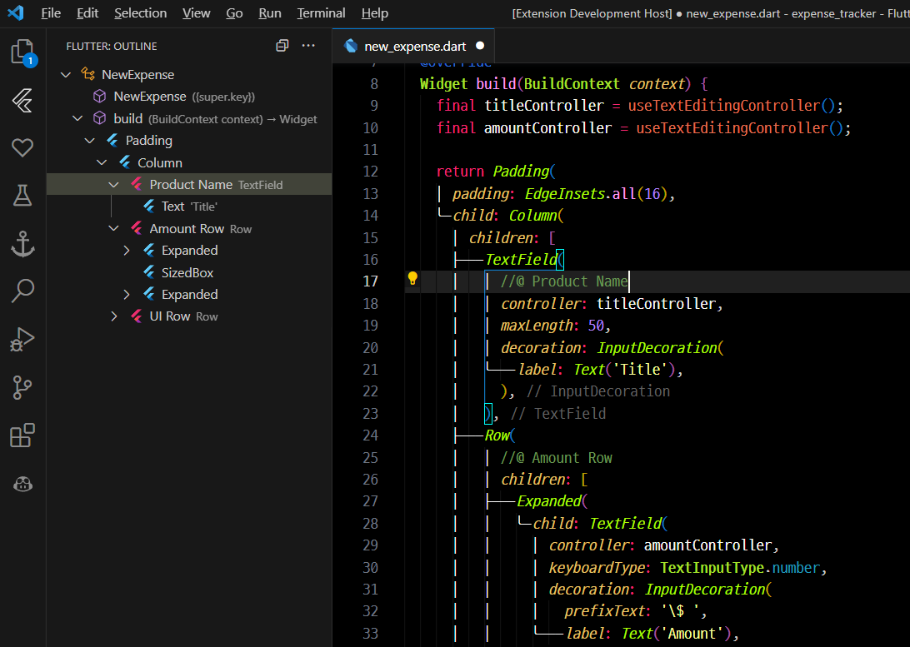

# Flutter Outline Labeler

This extension enhances the Flutter Outline in by displaying custom labels for widgets based on comments in your Dart code. It provides a more intuitive way to navigate and understand your Flutter project structure.

## Features

- Displays custom labels and icons for widgets in the Flutter Outline view
- Automatically updates the custom labels based on comments in your Dart code
- Retains the original functionality of the Flutter Outline view

## Usage

1. Install this extension alongside the official Dart extension in Visual Studio Code.
2. Add a comment with the custom label for a widget in your Dart code, using the format `//@ Custom Label`.
3. The custom label will be displayed in the Flutter Outline view for the corresponding widget.

## Example

In your Dart code, add a comment with the custom label:

```dart
//@ My Custom Button
ElevatedButton(
  onPressed: () {},
  child: Text('Click me'),
)
```

In the Flutter Outline view, the custom label "My Custom Button" will be displayed for the `ElevatedButton` widget.

## Requirements

Dart extension (dart-code.dart-code) 
> https://marketplace.visualstudio.com/items?itemName=Dart-Code.dart-code
	
## Installation

1. Download and install this extension from the Visual Studio Code marketplace.
2. Ensure that the Dart extension is installed and active.